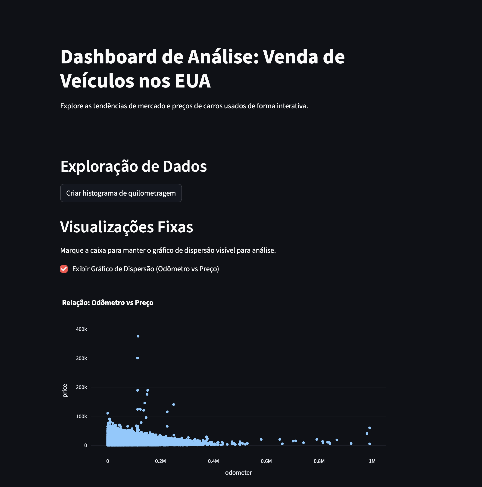

# Dashboard de Análise de Veículos (EUA) 🚗

Este projeto foi desenvolvido como parte do meu MBA em Data Science & AI. Ele representa a intersecção entre a minha base em **Design Visual** e o meu desenvolvimento em **Ciência de Dados**, unindo uma interface limpa e funcional a um processo rigoroso de tratamento de dados. O objetivo é oferecer uma interface interativa para explorar um conjunto de dados de anúncios de vendas de carros nos EUA, identificando padrões de preços e quilometragem.

## 🚀 Link do Aplicativo
[Acesse o Dashboard Online aqui](https://project-4-vehicle-us.onrender.com)

## 

## 🛠️ Tecnologias Utilizadas
* **Python**: Linguagem base.
* **Streamlit**: Framework para a criação da interface web.
* **Pandas**: Manipulação e limpeza dos dados.
* **Plotly Express**: Criação de gráficos interativos.
* **Render**: Plataforma de hospedagem (Cloud Deployment).

## 📊 Funcionalidades
* **Histograma de Quilometragem**: Visualização da distribuição de odômetro dos veículos via botão.
* **Gráfico de Dispersão**: Análise da correlação entre Preço vs. Quilometragem através de uma caixa de seleção (checkbox).
* **Limpeza de Dados**: Tratamento de valores ausentes para garantir a integridade das visualizações.

## 📂 Estrutura do Repositório
* `app.py`: Código principal do aplicativo Streamlit.
* `vehicles_us.csv`: Conjunto de dados utilizado.
* `notebooks/EDA.ipynb`: Análise exploratória inicial.
* `requirements.txt`: Lista de dependências para o deploy.
* `.streamlit/config.toml`: Configurações de porta para o Render.

## ⚙️ Como executar localmente
1. Clone o repositório;
2. Crie um ambiente virtual (opcional, porém recomendado);
3. Instale as dependências: `pip install -r requirements.txt`;
4. Execute: `streamlit run app.py`;

## 🧹 Processo de Limpeza de Dados
A etapa de limpeza realizada no notebook `EDA.ipynb` e replicada no `app.py` foi fundamental para garantir a integridade das visualizações. Os principais tratamentos foram:

* **Tratamento de Valores Ausentes:**
    * `is_4wd`: Preenchido com `0` (indicando que o veículo não possui tração 4x4) e convertido para tipo inteiro.
    * `paint_color`: Preenchido com `'unknown'` para anúncios que não especificavam a cor.
    * `model_year`, `cylinders` e `odometer`: Preenchidos com a **mediana** de cada coluna para evitar distorções por valores extremos (outliers).
* **Conversão de Tipos:**
    * As colunas `model_year` e `cylinders` foram convertidas de float para **inteiro**, eliminando casas decimais desnecessárias e melhorando a apresentação visual nos gráficos e tabelas.

## 📊 Funcionalidades do Dashboard
* **Histograma Interativo**: Permite visualizar a distribuição da quilometragem dos veículos através de um botão de comando.
* **Gráfico de Dispersão**: Analisa a correlação entre o preço e o ano do modelo ou quilometragem, acionado por uma caixa de seleção (checkbox).
* **Interface Dinâmica**: O dashboard responde em tempo real às interações do utilizador, facilitando a exploração de dados específicos.
